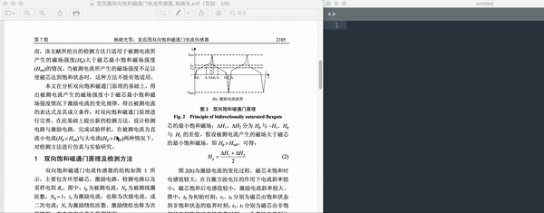

## Alfred是什么
[Alfred](https://www.alfredapp.com/)是macOS的应用程序启动器和生产力应用程序。在Mac上可以通过Alfred快捷的打开App、执行系统指令、执行脚本、快速的在想要的网站搜索关键词（如谷歌、百度、维基百科、淘宝等）。

以上介绍的都是Alfred的基本功能，除此之外，它还可以编写Workflow来实现更多的功能。本文将介绍如何通过Workflow实现OCR文字识别，提高工作效率。

## 基于Workflow的OCR文字识别

### 首先下载Alfred

第一步[下载Alfred](https://xclient.info/s/alfred.html)，确保其正常工作。

### 下载OCR Workflow

接着在Github上[下载OCR Workflow](https://github.com/oott123/alfred-clipboard-ocr)，本Workflow为热心网友制作，可以按照其介绍的使用说明部署。

### 截图并调用Alfred实现OCR

## 总结

本文主要通过Alfred这款效率工具，在其基本功能的基础上介绍其基于Workflow文字识别的实现。通过筛选网上现有的Workflow，挑选出效果最好的一款，且其本身的使用说明已经比较详尽，按照其步骤操作基本可以实现其功能。

基于此Workflow实现的文字OCR识别准确率高，并且能够识别换行，操作简单不用额外下载软件，并且完全免费，对标市面上已有的付费软件，使用体验优于付费软件。