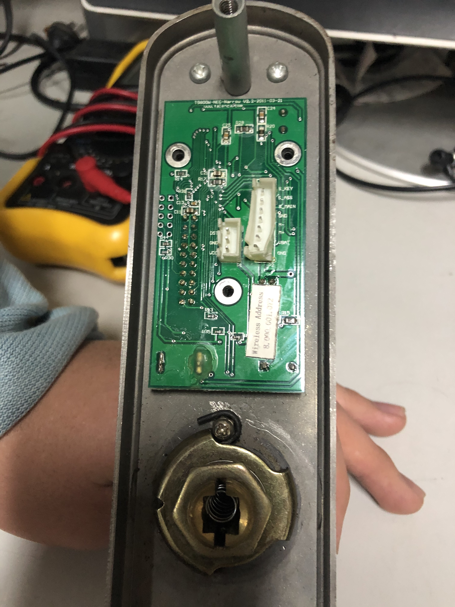
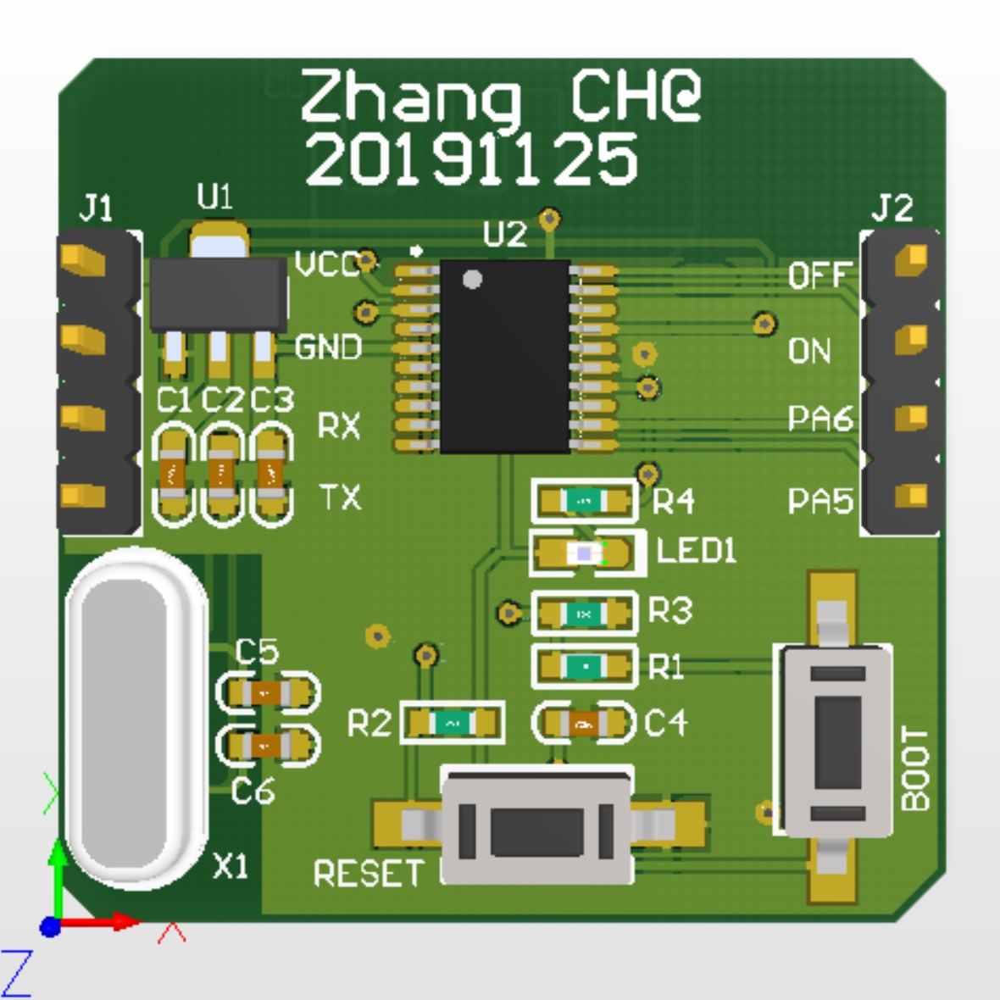

## 前言

常进的实验室门采用NFC模块配合钥匙打开，但运气太差碰到了学校网络问题导致门卡授权失败无法开门，同时钥匙也由于常年不用而不翼而飞，平时进门就需要求助小伙伴而变得异常麻烦，所以寻求一个快捷、实用的门锁改装方法就提上了日程。

在改装前曾**多次**咨询过学校后勤，但大多时间都是推脱来逃避责任，如果想要更换锁芯更是需要**300**元，这让我萌生了利用蓝牙来开门的想法，这样可以仅仅加入一个蓝牙控制模块即可，剩余的供电和电机控制部分都可以直接利用。

## 控制模块设计

首先为了控制门内的电机模块，所以需要拆解门锁了解其控制时序，拆解后锁内NFC控制模块如下图所示（板子竟然是**2011**年做的，有年头了）。可以看出其外接引脚较少，包含供电、电机正反转引脚。通过万用表和示波器对其进行分析，得出NFC控制模块需**5V**供电；模块在接收到开门指令后首先电机正转信号置高**100ms**后置低，间隔**8**秒后电机反转信号置高**100ms**后置低。

明白了NFC控制模块的控制时序后，就可以接管其控制权限，从而实现蓝牙控制。由于整个开门过程需要对电机进行开门与关门两步操作，同时还要接收来自蓝牙模块指令，所以采用MCU+蓝牙模块的方式进行控制。这里需要注意的是，电机的驱动至少需要**100mA**的驱动电流，MCU的引脚无法提高这么高的驱动能力，故需将MCU引脚接到NFC模块上的驱动芯片前级。

由于之前未使用过蓝牙模块，故首先在某宝上先购买模块化组件进行拼装（如下图所示）。同时因为锁内空间有限，故模块的选取受限，筛选后选择了**STM32F030F4**作为MCU，**CC2541**作为蓝牙模块。

作为第一次实验效果还不错，板子在接收到开门指令后可以正常开门，且从外面看起来锁的外观无任何变化，至此已经完成了初步实验，基本满足预期设计指标，开门问题得到了解决。

但这里还有一个问题需要解决——**功耗**。两个模块工作时的电流为**40mA**，功耗惊人的高，模块仅能持续工作10天。原因是两个模块都未开启低功耗模式，且外围电路会存在损耗，故需对目前设计进行优化以降低功耗。

## 控制模块设计优化

模块设计优化需做两个工作：

1. 精简模块，进一步缩小模块尺寸；

2. 降低功耗，使得模块能够持续工作1年以上。

优化后的设计，将MCU与蓝牙模块集成在一块PCB上，同时外围电路去掉了无用的器件，在缩小模块尺寸的基础上降低了模块的功耗，优化后的模块工作电流仅为**400uA**，基本满足优化的设计指标。设计图与实物图如下图所示。

## 总结

由NFC的授权失败到基于蓝牙的门锁改装，前后经历了两个周末，利用周末的碎片时间对蓝牙与低功耗的研究与实践，终于在可用性和持续性的前提下满足了开门的需求。在整个实践过程中，开始以为这是一个很简单的送分题，没想到最后在低功耗的问题上研究了几个小时，导致现在已经将目标瞄准了TI-CC2640，由于这款蓝牙芯片本身集成ARM芯片，能够实现单个蓝牙芯片替代目前所设计模块。（~~计划年后对模块进行第二次优化，将功耗降低至**100uA**以下~~）